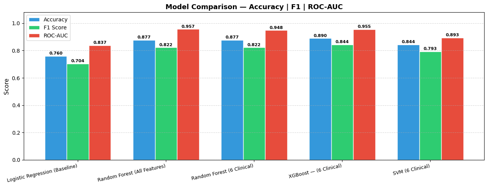
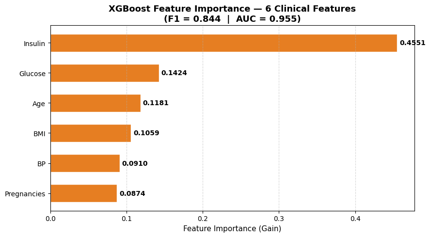

# 🩸 Diabetes-Prediction-ML

> A comparative study of machine learning models for Type-2 Diabetes prediction using the Pima Indians Diabetes Dataset — with clinical feature curation, rigorous preprocessing, and explainability via feature importance

[](https://www.python.org/)
[](https://scikit-learn.org/)
[](https://xgboost.readthedocs.io/)
[](https://colab.research.google.com/drive/14g2fFDt5sLTEcg1jHdVxFgESLXD-PVLd)

---

## 🩺 Clinical Background

**Diabetes mellitus** is a chronic and pervasive condition posing significant challenges to global public health. Early identification of at-risk individuals is key to improving patient outcomes and reducing the burden of complications.

The **Pima Indians Diabetes Dataset**, originally from the National Institute of Diabetes and Digestive and Kidney Diseases, provides a well-established benchmark for diabetes risk prediction. This project develops and compares multiple ML models on this dataset, with a focus on clinical interpretability and methodological rigour.

---

## 🎯 Project Overview

**Capstone Project 1** for the Executive Programme for AI in Healthcare, IIT Delhi — **Team 10**

| | |
|---|---|
| **Task** | Binary classification (Diabetic / Non-Diabetic) |
| **Dataset** | Pima Indians Diabetes Dataset (768 subjects, 8 features) |
| **Population** | Females ≥ 21 years, Pima Indian heritage |
| **Class distribution** | Imbalanced — 65% Non-Diabetic, 35% Diabetic |
| **Best Model** | XGBoost with 6 curated features |
| **Best Accuracy** | **0.8896** |
| **Best AUC-ROC** | **0.9548** |
| **Framework** | Python / Scikit-learn / XGBoost |
| **Platform** | Google Colab |

---

## 📋 Dataset

| Feature | Description |
|---|---|
| Pregnancies | Number of times pregnant |
| Glucose | Plasma glucose after 2-hr OGTT |
| Blood Pressure | Diastolic blood pressure (mm Hg) |
| Skin Thickness | Triceps skin-fold thickness (mm) |
| Insulin | 2-hr serum insulin after OGTT (µU/ml) |
| BMI | Body mass index (kg/m²) |
| Diabetes Pedigree | Diabetes pedigree function |
| Age | Age in years |
| **Outcome** | **Target — 1 = Diabetic, 0 = Non-Diabetic** |

Dataset available at: [Kaggle — Pima Indians Diabetes](https://www.kaggle.com/datasets/uciml/pima-indians-diabetes-database)

---

## ⚙️ Methodology

### Preprocessing Pipeline

```
Raw Data (768 subjects)
       │
  80/20 Train-Test Split  ← enforced BEFORE any imputation (no data leakage)
       │
  Clinically Impossible Zero Detection
  (Glucose, BP, SkinThickness, Insulin, BMI — zeros are physiologically impossible)
       │
  Class-Conditional Median Imputation (training set only)
       │
  Z-score Standardisation (StandardScaler fit on training set)
       │
  Model Training & Evaluation
```

**Key preprocessing decisions:**
- Train-test split performed *before* imputation to strictly prevent data leakage
- Zeros in clinical variables treated as missing values (not true measurements)
- Class-conditional median imputation preserves outcome-specific distributions
- SMOTE tested but excluded — synthetic oversampling introduced noise and degraded performance
- StandardScaler applied to ensure convergence in distance/gradient-based models

### Feature Selection

6 curated clinical features were selected via interactive stepwise forward selection, starting with Insulin (clinically most relevant), adding features iteratively if they improved F1-score on a Random Forest model:

**Selected features: Insulin, Glucose, Age, BMI, Blood Pressure, Pregnancies**

### Models Compared

| Model | Configuration |
|---|---|
| Logistic Regression | Baseline — all 8 features |
| Random Forest | All 8 features |
| Random Forest | 6 curated features |
| SVM | RBF kernel — 6 curated features |
| **XGBoost** | **GridSearchCV — 6 curated features** |
| Ensemble | RF + SVM + XGBoost stacked with LR meta-classifier |

---

## 📊 Results

| Model | Accuracy | F1 Score | AUC-ROC | False Negatives |
|---|---|---|---|---|
| Logistic Regression | 0.7597 | 0.7040 | 0.8369 | 10 |
| Random Forest (all features) | 0.8766 | 0.8224 | 0.9570 | 10 |
| Random Forest (6 features) | 0.8766 | 0.8224 | 0.9484 | 10 |
| SVM (6 features) | 0.8442 | 0.7931 | 0.8935 | 8 |
| **XGBoost (6 features)** ✅ | **0.8896** | **0.8440** | **0.9548** | **8** |
| Ensemble (RF+SVM+XGB+LR) | 0.8770 | 0.8220 | 0.9490 | 10 |

> **Best model:** XGBoost with 6 curated features — highest accuracy, F1, and AUC-ROC. Notably, the stacking ensemble did not outperform the standalone XGBoost, suggesting the tuned tree-based model had already captured the underlying patterns effectively.

### Feature Importance (XGBoost)

Top 4 features driving model predictions — aligned with established clinical knowledge:

1. **Insulin** — strongest predictor
2. **Glucose** — plasma glucose post-OGTT
3. **Age** — risk increases with age
4. **BMI** — key obesity-related risk factor

---

## 🔬 Key Insights

**What worked:**
- Rigorous data leakage prevention via early train-test split
- Clinical domain knowledge guiding feature selection outperformed purely statistical methods
- GridSearchCV hyperparameter tuning was critical for XGBoost and Random Forest performance
- Feature importance output provides clinically explainable model decisions

**What didn't work (and why):**
- SMOTE degraded performance — synthetic minority samples introduced noise on this small dataset
- Stacking ensemble underperformed standalone XGBoost — optimised tree models were already near-optimal

**Limitations:**
- Dataset limited to females ≥ 21 years of Pima Indian heritage — not generalisable to broader populations
- Class-conditional imputation using the target variable may introduce minor leakage; future work should evaluate KNNImputer or IterativeImputer

---

## 📁 Repository Structure

```
Diabetes-Prediction-ML/
│
├── notebooks/
│   └── diabetes_xgboost_v0_02.ipynb    ← Full end-to-end pipeline
│
├── data/
│   └── diabetes.csv                     # Pima Indians Diabetes Dataset
│
├── results/
│   ├── Model_comparison.png             # Performance comparison chart
│   ├── Roc_Curve.png                   # ROC curves for all models
│   ├── Feature_importance.png           # XGBoost feature importance
│   └── confusion_matrix.png             # Best model confusion matrix
│
├── requirements.txt
├── LICENSE
└── README.md
```

---

## ⚙️ Setup & Usage

### Requirements

```bash
pip install -r requirements.txt
```

Key dependencies:
- `scikit-learn >= 1.0`
- `xgboost`
- `pandas`, `numpy`
- `matplotlib`, `seaborn`

### Run the notebook

Open directly in Colab:

[](https://colab.research.google.com/drive/14g2fFDt5sLTEcg1jHdVxFgESLXD-PVLd)

Or clone and run locally:

```bash
git clone https://github.com/YOUR_USERNAME/Diabetes-Prediction-ML.git
cd Diabetes-Prediction-ML
jupyter notebook notebooks/diabetes_xgboost_v0_02.ipynb
```

### Key configuration

```python
RANDOM_STATE = 42          # Global seed for reproducibility
TEST_SIZE    = 0.20        # 80/20 train-test split
CLINICAL_ZERO_COLS = ['Glucose', 'BP', 'SkinThickness', 'Insulin', 'BMI']
CURATED_FEATURES   = ['Insulin', 'Age', 'Glucose', 'BMI', 'BP', 'Pregnancies']
```

---

## 🖼️ Sample Results

> *(Plots will be added here)*

| Model Comparison | ROC Curves | Feature Importance |
|:---:|:---:|:---:|
|  |  |  |

---

## 👥 Team

Capstone Project 1 by **Team 10**, Executive Programme for AI in Healthcare, IIT Delhi

Alfred Thomas · Heidrun Zeug · Kiran Kamble · **Baby Komal** · Muneesh Kapoor · Nitika Jesingh · Saptarshi Paul Choudhury · Shivani Sheth · Shuvadeep Ganguly · Sumit Talwar

---

## 🙏 Acknowledgements

- IIT Delhi Executive Programme for AI in Healthcare
- National Institute of Diabetes and Digestive and Kidney Diseases — original dataset source
- [Kaggle — Pima Indians Diabetes Database](https://www.kaggle.com/datasets/uciml/pima-indians-diabetes-database)
- Scikit-learn and XGBoost open-source communities
